<div align="center">

  <a href="https://naimur-portflio.vercel.app">
    
  </a>

</div>

<br />

<!-- ==================== CONTACT ==================== -->

<div align="center">

  <a href="mailto:misternaimur@gmail.com">
    
  </a>

  </svg>" width="5%" />

  <a href="https://www.linkedin.com/in/misternaimur">
    
  </a>

  </svg>" width="5%" />

  <a href="https://github.com/misternaimur">
    
  </a>

</div>

<br />

<!-- ==================== TECH STACK ==================== -->

<h2 align="center">Tech Stack</h2>

<div align="center">

  <nobr>

```


```

  </nobr>

</div>

<div align="center">

  <nobr>

```


```

  </nobr>

</div>

<br />

<!-- ==================== ABOUT ==================== -->

<h2 align="center">About Me</h2>

<p align="center">
  Junior Frontend Developer with practical full-stack experience in
  React, Next.js, TypeScript, Node.js, Express.js, MongoDB, and Tailwind CSS.
</p>

<p align="center">
  I enjoy building responsive interfaces, integrating APIs,
  working with databases and authentication, and collaborating
  with teams using Git, GitHub, Jira, and Scrum.
</p>

<!-- ==================== STATS ==================== -->

<h2 align="center">GitHub & Coding Stats</h2>

<div align="center">

  <nobr>

```
<a href="https://github.com/misternaimur">
  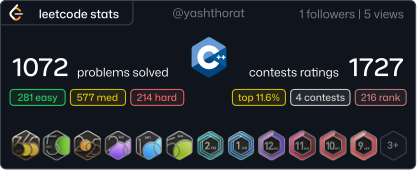
</a>

</svg>"
  width="1.42%"
/>

<a href="https://github.com/misternaimur">
  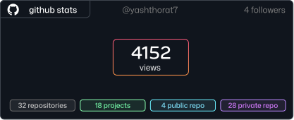
</a>
```

  </nobr>

</div>

<br />
<br />

<!-- ==================== PROJECTS ==================== -->

<h2 align="center">Featured Projects</h2>

<div align="center">

  <nobr>

```
<a href="https://github.com/misternaimur/foodiego">
  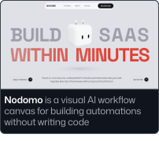
</a>

</svg>"
  width="1.42%"
/>

<a href="#">
  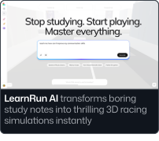
</a>

</svg>"
  width="1.42%"
/>

<a href="#">
  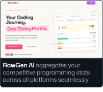
</a>

</svg>"
  width="1.42%"
/>

<a href="#">
  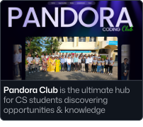
</a>
```

  </nobr>

</div>

<div align="center">

  <nobr>

```
<a href="#">
  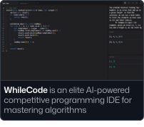
</a>

</svg>"
  width="1.42%"
/>

<a href="#">
  
</a>

</svg>"
  width="1.42%"
/>

<a href="#">
  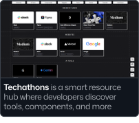
</a>

</svg>"
  width="1.42%"
/>

<a href="#">
  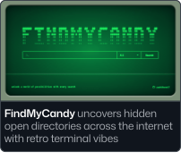
</a>
```

  </nobr>

</div>

<div align="center">

  <nobr>

```
<a href="#">
  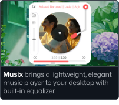
</a>

</svg>"
  width="1.42%"
/>

<a href="#">
  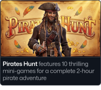
</a>

</svg>"
  width="1.42%"
/>

<a href="#">
  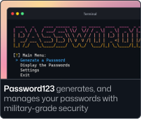
</a>

</svg>"
  width="1.42%"
/>

<a href="https://github.com/misternaimur?tab=repositories">
  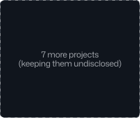
</a>
```

  </nobr>

</div>

<br />
<br />

<!-- ==================== CURRENT FOCUS ==================== -->

<h2 align="center">Currently Focused On</h2>

<div align="center">

  <p>
    Full-Stack Development · Next.js · TypeScript · Backend APIs ·
    AI-Powered Applications · System Design
  </p>

</div>

<!-- ==================== EDUCATION ==================== -->

<h2 align="center">Education</h2>

<p align="center">
  <strong>B.Sc. in Computer Science & Engineering</strong><br />
  Premier University, Chittagong, Bangladesh
</p>

<!-- ==================== FOOTER ==================== -->

<br />
<br />

<div align="center">

  

</div>
